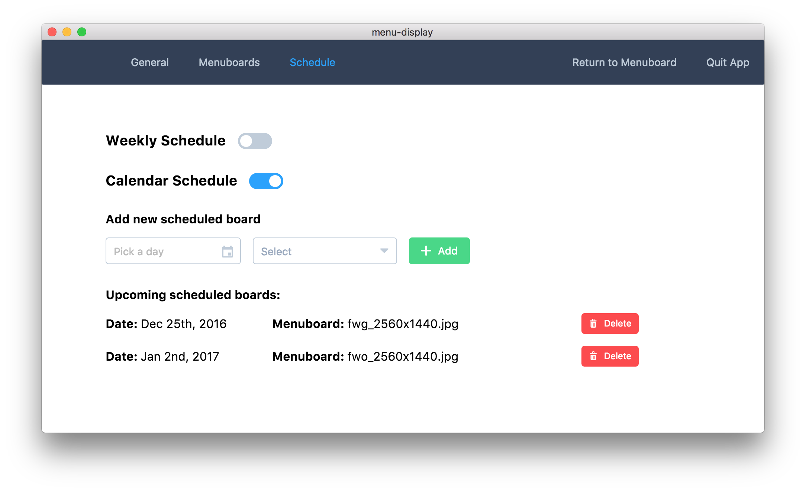

# Menu Display

> A simple Menu Board application

We have a need for simple static menu boards that show an image fullscreen on a TV. Currently we're either using CBORD's unsupported menu board system or a script that displays an image within Internet Explorer. This apps goal is to replace the second type of menu board; the hacky script ones.

While providing the same basic feature of displaying an image fullscreen, it also adds the ability to schedule different boards for different days of the week or for boards to start displaying on specific dates.



## Build Setup

This project was generated from [electron-vue](https://github.com/SimulatedGREG/electron-vue) using [vue-cli](https://github.com/vuejs/vue-cli). Documentation about this project can be found [here](https://simulatedgreg.gitbooks.io/electron-vue/content/index.html) including build and packaging instructions.

The project is built using [Electron](http://electron.atom.io/) and [Vue](https://vuejs.org/), and requires [Node.JS](https://nodejs.org/en/) `v5.10.0` or higher to be installed.


``` bash
# install dependencies
npm install

# serve with hot reload at localhost:9080
npm run dev

# build electron app for production for all platforms
npm run build

# build elecrtron app for production for win32 x64
npm run build:win32

# build electron app for production for arm (raspberry pi)
npm run build:arm

# lint all JS/Vue component files in `app/src`
npm run lint

# run webpack in production
npm run pack
```
